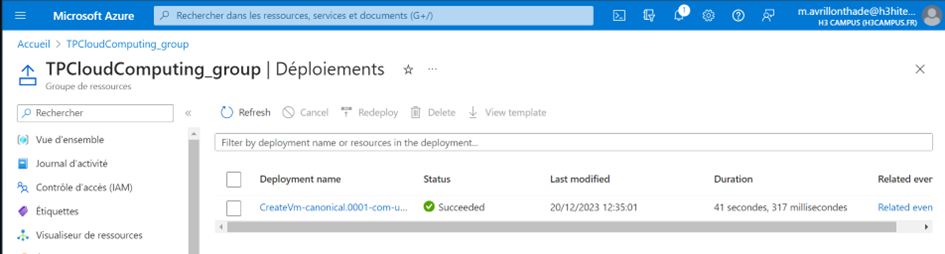
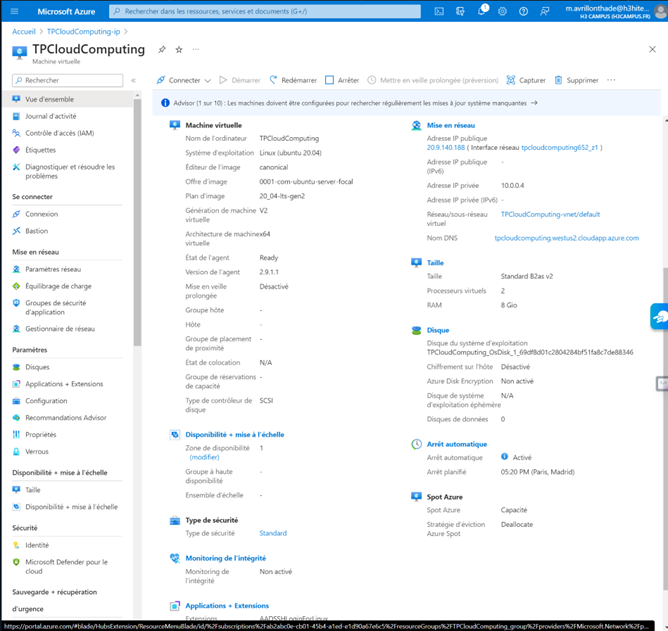

[Back to Home](../README.md)

# Create a Virtual Machine (VM)

## Location - West US 2 (Zone 1)

I chose this location because it offers a variety of VM options at competitive costs, while being geographically advantageous for my needs.

## VM Size - Standard B2as v2 (2 vCPUs, 8 GB RAM)

This configuration provides a good balance between performance and cost for moderate workloads. It is sufficient for my applications without being overly expensive.

## Scheduled Auto-Shutdown

This feature is crucial for managing costs by shutting down the VM during periods of inactivity.

## Public IP Address and DNS

I assigned a public IP address and a DNS name to enable remote access and connectivity to the VM.




## Export template

```
{
"$schema": "https://schema.management.azure.com/schemas/2019-04-01/deploymentTemplate.json#",
"contentVersion": "1.0.0.0",
"parameters": {
"virtualMachines_TPCloudComputing_name": {
"defaultValue": "TPCloudComputing",
"type": "String"
},
"disks_TPCloudComputing_OsDisk_1_69df8d01c2804284bf51fa8c7de88346_externalid": {
"defaultValue": "/subscriptions/ab2abc0e-cb01-45b4-a1ed-e1d90a67e6c5/resourceGroups/TPCLOUDCOMPUTING_GROUP/providers/Microsoft.Compute/disks/TPCloudComputing_OsDisk_1_69df8d01c2804284bf51fa8c7de88346",
"type": "String"
},
"networkInterfaces_tpcloudcomputing652_z1_externalid": {
"defaultValue": "/subscriptions/ab2abc0e-cb01-45b4-a1ed-e1d90a67e6c5/resourceGroups/TPCloudComputing_group/providers/Microsoft.Network/networkInterfaces/tpcloudcomputing652_z1",
"type": "String"
}
},
"variables": {},
"resources": [
{
"type": "Microsoft.Compute/virtualMachines",
"apiVersion": "2023-03-01",
"name": "[parameters('virtualMachines_TPCloudComputing_name')]",
"location": "westus2",
"zones": [
"1"
],
"identity": {
"type": "SystemAssigned"
},
"properties": {
"hardwareProfile": {
"vmSize": "Standard_B2as_v2"
},
"additionalCapabilities": {
"hibernationEnabled": false
},
"storageProfile": {
"imageReference": {
"publisher": "canonical",
"offer": "0001-com-ubuntu-server-focal",
"sku": "20_04-lts-gen2",
"version": "latest"
},
"osDisk": {
"osType": "Linux",
"name": "[concat(parameters('virtualMachines_TPCloudComputing_name'), '_OsDisk_1_69df8d01c2804284bf51fa8c7de88346')]",
"createOption": "FromImage",
"caching": "ReadWrite",
"managedDisk": {
"id": "[parameters('disks_TPCloudComputing_OsDisk_1_69df8d01c2804284bf51fa8c7de88346_externalid')]"
},
"deleteOption": "Delete"
},
"dataDisks": [],
"diskControllerType": "SCSI"
},
"osProfile": {
"computerName": "[parameters('virtualMachines_TPCloudComputing_name')]",
"adminUsername": "ERTKid",
"linuxConfiguration": {
"disablePasswordAuthentication": true,
"ssh": {
"publicKeys": [
{
"path": "/home/ERTKid/.ssh/authorized_keys",
"keyData": "ssh-rsa AAAAB3NzaC1yc2EAAAADAQABAAABgQC1hhYPHpzrSieWy4DbT5gA6fKpf3zhEyu+zAsIv3QN9QWLyna2yCt0gypf8Snoz3h1Hzuqh6lo0CAU+dAAccqtX0aIfS8AzUHPLAO3T6uInhL5wm/J0XcLr30jm2Ncf/v+n9aYXaBbx3A35rDGOF0kNPiCeZtRC4I+zBxx6RmHyX5oX79CTfzI2SRjwuAuxIcMiRUCyhJ+q81GB0P3VlSBrXu1elLVH7+M6L9CpFCrHL+n6i6Gy1Kc/oSsygk3SSJOCAu/56nTyFni8L4UWAiCdqM7FJUBMUkENSPg0M5mr+HhtS+dfpc0w7DwtMed7MNzUfHd/D3LegBxDbFt5MfuDeVkY11PEDr6hdrB1mrLTdTsJmTGJM7nib9HRXeQtqY6AANG7+o69s4VIDiH1hz4kwYOy1arL9tVxTehm0XAC3ReM2e3zzzVpU5oe2gJpMdQ2NQohrb31oQXgaIqGTZ6xu7CcMZnyXSo6BBQX+4vpgkUx1sMCzf0ztjLkFwJuuk= generated-by-azure"
}
]
},
"provisionVMAgent": true,
"patchSettings": {
"patchMode": "ImageDefault",
"assessmentMode": "ImageDefault"
},
"enableVMAgentPlatformUpdates": false
},
"secrets": [],
"allowExtensionOperations": true,
"requireGuestProvisionSignal": true
},
"networkProfile": {
"networkInterfaces": [
{
"id": "[parameters('networkInterfaces_tpcloudcomputing652_z1_externalid')]",
"properties": {
"deleteOption": "Detach"
}
}
]
},
"diagnosticsProfile": {
"bootDiagnostics": {
"enabled": true
}
},
"priority": "Spot",
"evictionPolicy": "Deallocate",
"billingProfile": {
"maxPrice": -1
}
}
}
]
}
```
