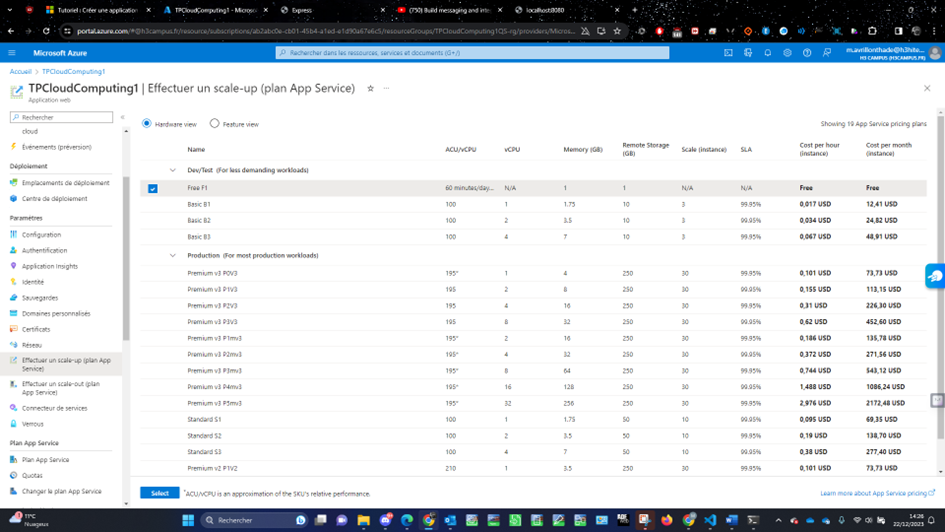
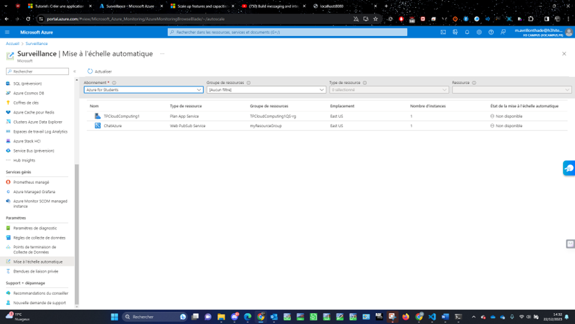

[Back to Home](../README.md)

# Set Up Auto-Scaling

When facing fluctuating workloads, it's vital to have a system that adapts resource allocation in real time. Azure's auto-scaling feature provides this flexibility, dynamically adjusting resource levels to optimize performance while effectively managing costs.

## Not available (because free version ?)

