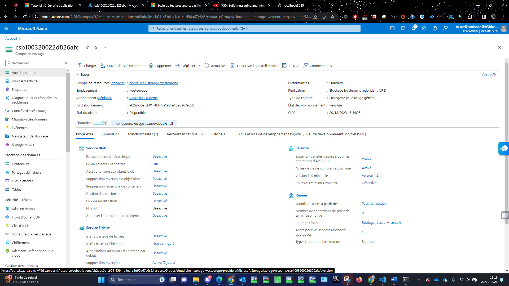
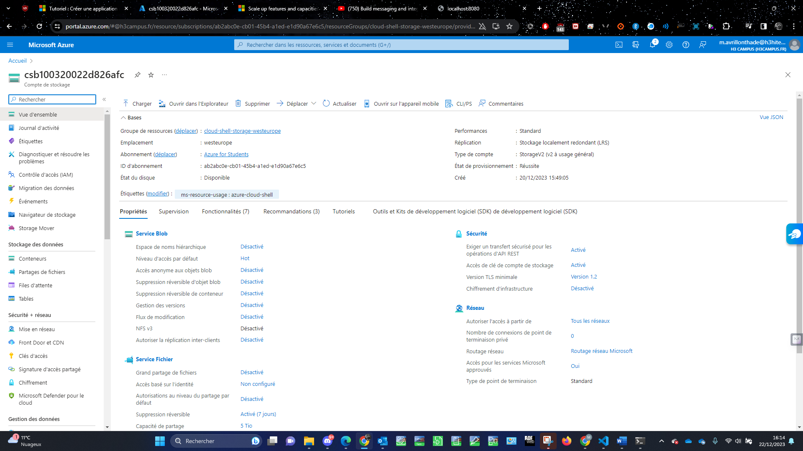

[Back to Home](../README.md)

# Set Up Blob Storage

Here, I've implemented Azure Blob Storage, a robust solution for storing unstructured data like logs and images, ensuring secure and scalable storage.




## Export template

```
{
    "$schema": "https://schema.management.azure.com/schemas/2019-04-01/deploymentTemplate.json#",
    "contentVersion": "1.0.0.0",
    "parameters": {
        "storageAccounts_csb100320022d826afc_name": {
            "defaultValue": "csb100320022d826afc",
            "type": "String"
        }
    },
    "variables": {},
    "resources": [
        {
            "type": "Microsoft.Storage/storageAccounts",
            "apiVersion": "2023-01-01",
            "name": "[parameters('storageAccounts_csb100320022d826afc_name')]",
            "location": "westeurope",
            "tags": {
                "ms-resource-usage": "azure-cloud-shell"
            },
            "sku": {
                "name": "Standard_LRS",
                "tier": "Standard"
            },
            "kind": "StorageV2",
            "properties": {
                "allowCrossTenantReplication": false,
                "minimumTlsVersion": "TLS1_2",
                "allowBlobPublicAccess": false,
                "networkAcls": {
                    "bypass": "AzureServices",
                    "virtualNetworkRules": [],
                    "ipRules": [],
                    "defaultAction": "Allow"
                },
                "supportsHttpsTrafficOnly": true,
                "encryption": {
                    "services": {
                        "file": {
                            "keyType": "Account",
                            "enabled": true
                        },
                        "blob": {
                            "keyType": "Account",
                            "enabled": true
                        }
                    },
                    "keySource": "Microsoft.Storage"
                },
                "accessTier": "Hot"
            }
        },
        {
            "type": "Microsoft.Storage/storageAccounts/blobServices",
            "apiVersion": "2023-01-01",
            "name": "[concat(parameters('storageAccounts_csb100320022d826afc_name'), '/default')]",
            "dependsOn": [
                "[resourceId('Microsoft.Storage/storageAccounts', parameters('storageAccounts_csb100320022d826afc_name'))]"
            ],
            "sku": {
                "name": "Standard_LRS",
                "tier": "Standard"
            },
            "properties": {
                "cors": {
                    "corsRules": []
                },
                "deleteRetentionPolicy": {
                    "allowPermanentDelete": false,
                    "enabled": false
                }
            }
        },
        {
            "type": "Microsoft.Storage/storageAccounts/fileServices",
            "apiVersion": "2023-01-01",
            "name": "[concat(parameters('storageAccounts_csb100320022d826afc_name'), '/default')]",
            "dependsOn": [
                "[resourceId('Microsoft.Storage/storageAccounts', parameters('storageAccounts_csb100320022d826afc_name'))]"
            ],
            "sku": {
                "name": "Standard_LRS",
                "tier": "Standard"
            },
            "properties": {
                "protocolSettings": {
                    "smb": {}
                },
                "cors": {
                    "corsRules": []
                },
                "shareDeleteRetentionPolicy": {
                    "enabled": true,
                    "days": 7
                }
            }
        },
        {
            "type": "Microsoft.Storage/storageAccounts/queueServices",
            "apiVersion": "2023-01-01",
            "name": "[concat(parameters('storageAccounts_csb100320022d826afc_name'), '/default')]",
            "dependsOn": [
                "[resourceId('Microsoft.Storage/storageAccounts', parameters('storageAccounts_csb100320022d826afc_name'))]"
            ],
            "properties": {
                "cors": {
                    "corsRules": []
                }
            }
        },
        {
            "type": "Microsoft.Storage/storageAccounts/tableServices",
            "apiVersion": "2023-01-01",
            "name": "[concat(parameters('storageAccounts_csb100320022d826afc_name'), '/default')]",
            "dependsOn": [
                "[resourceId('Microsoft.Storage/storageAccounts', parameters('storageAccounts_csb100320022d826afc_name'))]"
            ],
            "properties": {
                "cors": {
                    "corsRules": []
                }
            }
        },
        {
            "type": "Microsoft.Storage/storageAccounts/blobServices/containers",
            "apiVersion": "2023-01-01",
            "name": "[concat(parameters('storageAccounts_csb100320022d826afc_name'), '/default/$web')]",
            "dependsOn": [
                "[resourceId('Microsoft.Storage/storageAccounts/blobServices', parameters('storageAccounts_csb100320022d826afc_name'), 'default')]",
                "[resourceId('Microsoft.Storage/storageAccounts', parameters('storageAccounts_csb100320022d826afc_name'))]"
            ],
            "properties": {
                "immutableStorageWithVersioning": {
                    "enabled": false
                },
                "defaultEncryptionScope": "$account-encryption-key",
                "denyEncryptionScopeOverride": false,
                "publicAccess": "None"
            }
        },
        {
            "type": "Microsoft.Storage/storageAccounts/blobServices/containers",
            "apiVersion": "2023-01-01",
            "name": "[concat(parameters('storageAccounts_csb100320022d826afc_name'), '/default/container-cloudcomputing')]",
            "dependsOn": [
                "[resourceId('Microsoft.Storage/storageAccounts/blobServices', parameters('storageAccounts_csb100320022d826afc_name'), 'default')]",
                "[resourceId('Microsoft.Storage/storageAccounts', parameters('storageAccounts_csb100320022d826afc_name'))]"
            ],
            "properties": {
                "immutableStorageWithVersioning": {
                    "enabled": false
                },
                "defaultEncryptionScope": "$account-encryption-key",
                "denyEncryptionScopeOverride": false,
                "publicAccess": "None"
            }
        },
        {
            "type": "Microsoft.Storage/storageAccounts/fileServices/shares",
            "apiVersion": "2023-01-01",
            "name": "[concat(parameters('storageAccounts_csb100320022d826afc_name'), '/default/cs-m-avrillonthade-h3hitema-fr-100320022d826afc')]",
            "dependsOn": [
                "[resourceId('Microsoft.Storage/storageAccounts/fileServices', parameters('storageAccounts_csb100320022d826afc_name'), 'default')]",
                "[resourceId('Microsoft.Storage/storageAccounts', parameters('storageAccounts_csb100320022d826afc_name'))]"
            ],
            "properties": {
                "accessTier": "TransactionOptimized",
                "shareQuota": 6,
                "enabledProtocols": "SMB"
            }
        }
    ]
}
```
