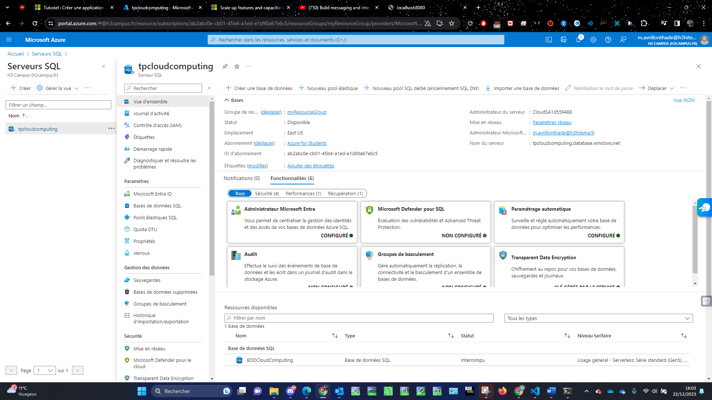

[Back to Home](../README.md)

# Create a SQL Database



## Export template

```
{
    "$schema": "https://schema.management.azure.com/schemas/2019-04-01/deploymentTemplate.json#",
    "contentVersion": "1.0.0.0",
    "parameters": {
        "vulnerabilityAssessments_Default_storageContainerPath": {
            "type": "SecureString"
        },
        "servers_tpcloudcomputing_name": {
            "defaultValue": "tpcloudcomputing",
            "type": "String"
        }
    },
    "variables": {},
    "resources": [
        {
            "type": "Microsoft.Sql/servers",
            "apiVersion": "2023-05-01-preview",
            "name": "[parameters('servers_tpcloudcomputing_name')]",
            "location": "eastus",
            "kind": "v12.0",
            "properties": {
                "administratorLogin": "CloudSA1d559488",
                "version": "12.0",
                "minimalTlsVersion": "1.2",
                "publicNetworkAccess": "Enabled",
                "administrators": {
                    "administratorType": "ActiveDirectory",
                    "principalType": "User",
                    "login": "m.avrillonthade@h3hitema.fr",
                    "sid": "ecd29ae6-c100-490b-ae09-6179f02414bf",
                    "tenantId": "b411b782-6223-4f57-86f8-97a8366a74ea",
                    "azureADOnlyAuthentication": true
                },
                "restrictOutboundNetworkAccess": "Disabled"
            }
        },
        {
            "type": "Microsoft.Sql/servers/administrators",
            "apiVersion": "2023-05-01-preview",
            "name": "[concat(parameters('servers_tpcloudcomputing_name'), '/ActiveDirectory')]",
            "dependsOn": [
                "[resourceId('Microsoft.Sql/servers', parameters('servers_tpcloudcomputing_name'))]"
            ],
            "properties": {
                "administratorType": "ActiveDirectory",
                "login": "m.avrillonthade@h3hitema.fr",
                "sid": "ecd29ae6-c100-490b-ae09-6179f02414bf",
                "tenantId": "b411b782-6223-4f57-86f8-97a8366a74ea"
            }
        },
        {
            "type": "Microsoft.Sql/servers/advancedThreatProtectionSettings",
            "apiVersion": "2023-05-01-preview",
            "name": "[concat(parameters('servers_tpcloudcomputing_name'), '/Default')]",
            "dependsOn": [
                "[resourceId('Microsoft.Sql/servers', parameters('servers_tpcloudcomputing_name'))]"
            ],
            "properties": {
                "state": "Disabled"
            }
        },
        {
            "type": "Microsoft.Sql/servers/advisors",
            "apiVersion": "2014-04-01",
            "name": "[concat(parameters('servers_tpcloudcomputing_name'), '/CreateIndex')]",
            "dependsOn": [
                "[resourceId('Microsoft.Sql/servers', parameters('servers_tpcloudcomputing_name'))]"
            ],
            "properties": {
                "autoExecuteValue": "Disabled"
            }
        },
        {
            "type": "Microsoft.Sql/servers/advisors",
            "apiVersion": "2014-04-01",
            "name": "[concat(parameters('servers_tpcloudcomputing_name'), '/DbParameterization')]",
            "dependsOn": [
                "[resourceId('Microsoft.Sql/servers', parameters('servers_tpcloudcomputing_name'))]"
            ],
            "properties": {
                "autoExecuteValue": "Disabled"
            }
        },
        {
            "type": "Microsoft.Sql/servers/advisors",
            "apiVersion": "2014-04-01",
            "name": "[concat(parameters('servers_tpcloudcomputing_name'), '/DefragmentIndex')]",
            "dependsOn": [
                "[resourceId('Microsoft.Sql/servers', parameters('servers_tpcloudcomputing_name'))]"
            ],
            "properties": {
                "autoExecuteValue": "Disabled"
            }
        },
        {
            "type": "Microsoft.Sql/servers/advisors",
            "apiVersion": "2014-04-01",
            "name": "[concat(parameters('servers_tpcloudcomputing_name'), '/DropIndex')]",
            "dependsOn": [
                "[resourceId('Microsoft.Sql/servers', parameters('servers_tpcloudcomputing_name'))]"
            ],
            "properties": {
                "autoExecuteValue": "Disabled"
            }
        },
        {
            "type": "Microsoft.Sql/servers/advisors",
            "apiVersion": "2014-04-01",
            "name": "[concat(parameters('servers_tpcloudcomputing_name'), '/ForceLastGoodPlan')]",
            "dependsOn": [
                "[resourceId('Microsoft.Sql/servers', parameters('servers_tpcloudcomputing_name'))]"
            ],
            "properties": {
                "autoExecuteValue": "Enabled"
            }
        },
        {
            "type": "Microsoft.Sql/servers/auditingPolicies",
            "apiVersion": "2014-04-01",
            "name": "[concat(parameters('servers_tpcloudcomputing_name'), '/Default')]",
            "location": "East US",
            "dependsOn": [
                "[resourceId('Microsoft.Sql/servers', parameters('servers_tpcloudcomputing_name'))]"
            ],
            "properties": {
                "auditingState": "Disabled"
            }
        },
        {
            "type": "Microsoft.Sql/servers/auditingSettings",
            "apiVersion": "2023-05-01-preview",
            "name": "[concat(parameters('servers_tpcloudcomputing_name'), '/Default')]",
            "dependsOn": [
                "[resourceId('Microsoft.Sql/servers', parameters('servers_tpcloudcomputing_name'))]"
            ],
            "properties": {
                "retentionDays": 0,
                "auditActionsAndGroups": [],
                "isStorageSecondaryKeyInUse": false,
                "isAzureMonitorTargetEnabled": false,
                "isManagedIdentityInUse": false,
                "state": "Disabled",
                "storageAccountSubscriptionId": "00000000-0000-0000-0000-000000000000"
            }
        },
        {
            "type": "Microsoft.Sql/servers/azureADOnlyAuthentications",
            "apiVersion": "2023-05-01-preview",
            "name": "[concat(parameters('servers_tpcloudcomputing_name'), '/Default')]",
            "dependsOn": [
                "[resourceId('Microsoft.Sql/servers', parameters('servers_tpcloudcomputing_name'))]"
            ],
            "properties": {
                "azureADOnlyAuthentication": true
            }
        },
        {
            "type": "Microsoft.Sql/servers/connectionPolicies",
            "apiVersion": "2023-05-01-preview",
            "name": "[concat(parameters('servers_tpcloudcomputing_name'), '/default')]",
            "location": "eastus",
            "dependsOn": [
                "[resourceId('Microsoft.Sql/servers', parameters('servers_tpcloudcomputing_name'))]"
            ],
            "properties": {
                "connectionType": "Default"
            }
        },
        {
            "type": "Microsoft.Sql/servers/databases",
            "apiVersion": "2023-05-01-preview",
            "name": "[concat(parameters('servers_tpcloudcomputing_name'), '/BDDCloudComputing')]",
            "location": "eastus",
            "dependsOn": [
                "[resourceId('Microsoft.Sql/servers', parameters('servers_tpcloudcomputing_name'))]"
            ],
            "sku": {
                "name": "GP_S_Gen5",
                "tier": "GeneralPurpose",
                "family": "Gen5",
                "capacity": 2
            },
            "kind": "v12.0,user,vcore,serverless,freelimit",
            "properties": {
                "collation": "SQL_Latin1_General_CP1_CI_AS",
                "maxSizeBytes": 34359738368,
                "catalogCollation": "SQL_Latin1_General_CP1_CI_AS",
                "zoneRedundant": false,
                "readScale": "Disabled",
                "autoPauseDelay": 60,
                "requestedBackupStorageRedundancy": "Local",
                "minCapacity": 0.5,
                "maintenanceConfigurationId": "/subscriptions/ab2abc0e-cb01-45b4-a1ed-e1d90a67e6c5/providers/Microsoft.Maintenance/publicMaintenanceConfigurations/SQL_Default",
                "isLedgerOn": false,
                "useFreeLimit": true,
                "freeLimitExhaustionBehavior": "AutoPause",
                "availabilityZone": "NoPreference"
            }
        },
        {
            "type": "Microsoft.Sql/servers/databases/advancedThreatProtectionSettings",
            "apiVersion": "2023-05-01-preview",
            "name": "[concat(parameters('servers_tpcloudcomputing_name'), '/master/Default')]",
            "dependsOn": [
                "[resourceId('Microsoft.Sql/servers', parameters('servers_tpcloudcomputing_name'))]"
            ],
            "properties": {
                "state": "Disabled"
            }
        },
        {
            "type": "Microsoft.Sql/servers/databases/auditingPolicies",
            "apiVersion": "2014-04-01",
            "name": "[concat(parameters('servers_tpcloudcomputing_name'), '/master/Default')]",
            "location": "East US",
            "dependsOn": [
                "[resourceId('Microsoft.Sql/servers', parameters('servers_tpcloudcomputing_name'))]"
            ],
            "properties": {
                "auditingState": "Disabled"
            }
        },
        {
            "type": "Microsoft.Sql/servers/databases/auditingSettings",
            "apiVersion": "2023-05-01-preview",
            "name": "[concat(parameters('servers_tpcloudcomputing_name'), '/master/Default')]",
            "dependsOn": [
                "[resourceId('Microsoft.Sql/servers', parameters('servers_tpcloudcomputing_name'))]"
            ],
            "properties": {
                "retentionDays": 0,
                "isAzureMonitorTargetEnabled": false,
                "state": "Disabled",
                "storageAccountSubscriptionId": "00000000-0000-0000-0000-000000000000"
            }
        },
        {
            "type": "Microsoft.Sql/servers/databases/extendedAuditingSettings",
            "apiVersion": "2023-05-01-preview",
            "name": "[concat(parameters('servers_tpcloudcomputing_name'), '/master/Default')]",
            "dependsOn": [
                "[resourceId('Microsoft.Sql/servers', parameters('servers_tpcloudcomputing_name'))]"
            ],
            "properties": {
                "retentionDays": 0,
                "isAzureMonitorTargetEnabled": false,
                "state": "Disabled",
                "storageAccountSubscriptionId": "00000000-0000-0000-0000-000000000000"
            }
        },
        {
            "type": "Microsoft.Sql/servers/databases/geoBackupPolicies",
            "apiVersion": "2023-05-01-preview",
            "name": "[concat(parameters('servers_tpcloudcomputing_name'), '/master/Default')]",
            "dependsOn": [
                "[resourceId('Microsoft.Sql/servers', parameters('servers_tpcloudcomputing_name'))]"
            ],
            "properties": {
                "state": "Disabled"
            }
        },
        {
            "type": "Microsoft.Sql/servers/databases/ledgerDigestUploads",
            "apiVersion": "2023-05-01-preview",
            "name": "[concat(parameters('servers_tpcloudcomputing_name'), '/master/Current')]",
            "dependsOn": [
                "[resourceId('Microsoft.Sql/servers', parameters('servers_tpcloudcomputing_name'))]"
            ],
            "properties": {}
        },
        {
            "type": "Microsoft.Sql/servers/databases/securityAlertPolicies",
            "apiVersion": "2023-05-01-preview",
            "name": "[concat(parameters('servers_tpcloudcomputing_name'), '/master/Default')]",
            "dependsOn": [
                "[resourceId('Microsoft.Sql/servers', parameters('servers_tpcloudcomputing_name'))]"
            ],
            "properties": {
                "state": "Disabled",
                "disabledAlerts": [
                    ""
                ],
                "emailAddresses": [
                    ""
                ],
                "emailAccountAdmins": false,
                "retentionDays": 0
            }
        },
        {
            "type": "Microsoft.Sql/servers/databases/transparentDataEncryption",
            "apiVersion": "2023-05-01-preview",
            "name": "[concat(parameters('servers_tpcloudcomputing_name'), '/master/Current')]",
            "dependsOn": [
                "[resourceId('Microsoft.Sql/servers', parameters('servers_tpcloudcomputing_name'))]"
            ],
            "properties": {
                "state": "Disabled"
            }
        },
        {
            "type": "Microsoft.Sql/servers/databases/vulnerabilityAssessments",
            "apiVersion": "2023-05-01-preview",
            "name": "[concat(parameters('servers_tpcloudcomputing_name'), '/master/Default')]",
            "dependsOn": [
                "[resourceId('Microsoft.Sql/servers', parameters('servers_tpcloudcomputing_name'))]"
            ],
            "properties": {
                "recurringScans": {
                    "isEnabled": false,
                    "emailSubscriptionAdmins": true
                }
            }
        },
        {
            "type": "Microsoft.Sql/servers/devOpsAuditingSettings",
            "apiVersion": "2023-05-01-preview",
            "name": "[concat(parameters('servers_tpcloudcomputing_name'), '/Default')]",
            "dependsOn": [
                "[resourceId('Microsoft.Sql/servers', parameters('servers_tpcloudcomputing_name'))]"
            ],
            "properties": {
                "isAzureMonitorTargetEnabled": false,
                "isManagedIdentityInUse": false,
                "state": "Disabled",
                "storageAccountSubscriptionId": "00000000-0000-0000-0000-000000000000"
            }
        },
        {
            "type": "Microsoft.Sql/servers/encryptionProtector",
            "apiVersion": "2023-05-01-preview",
            "name": "[concat(parameters('servers_tpcloudcomputing_name'), '/current')]",
            "dependsOn": [
                "[resourceId('Microsoft.Sql/servers', parameters('servers_tpcloudcomputing_name'))]"
            ],
            "kind": "servicemanaged",
            "properties": {
                "serverKeyName": "ServiceManaged",
                "serverKeyType": "ServiceManaged",
                "autoRotationEnabled": false
            }
        },
        {
            "type": "Microsoft.Sql/servers/extendedAuditingSettings",
            "apiVersion": "2023-05-01-preview",
            "name": "[concat(parameters('servers_tpcloudcomputing_name'), '/Default')]",
            "dependsOn": [
                "[resourceId('Microsoft.Sql/servers', parameters('servers_tpcloudcomputing_name'))]"
            ],
            "properties": {
                "retentionDays": 0,
                "auditActionsAndGroups": [],
                "isStorageSecondaryKeyInUse": false,
                "isAzureMonitorTargetEnabled": false,
                "isManagedIdentityInUse": false,
                "state": "Disabled",
                "storageAccountSubscriptionId": "00000000-0000-0000-0000-000000000000"
            }
        },
        {
            "type": "Microsoft.Sql/servers/firewallRules",
            "apiVersion": "2023-05-01-preview",
            "name": "[concat(parameters('servers_tpcloudcomputing_name'), '/ClientIp-2023-12-22_11-33-33')]",
            "dependsOn": [
                "[resourceId('Microsoft.Sql/servers', parameters('servers_tpcloudcomputing_name'))]"
            ]
        },
        {
            "type": "Microsoft.Sql/servers/keys",
            "apiVersion": "2023-05-01-preview",
            "name": "[concat(parameters('servers_tpcloudcomputing_name'), '/ServiceManaged')]",
            "dependsOn": [
                "[resourceId('Microsoft.Sql/servers', parameters('servers_tpcloudcomputing_name'))]"
            ],
            "kind": "servicemanaged",
            "properties": {
                "serverKeyType": "ServiceManaged"
            }
        },
        {
            "type": "Microsoft.Sql/servers/securityAlertPolicies",
            "apiVersion": "2023-05-01-preview",
            "name": "[concat(parameters('servers_tpcloudcomputing_name'), '/Default')]",
            "dependsOn": [
                "[resourceId('Microsoft.Sql/servers', parameters('servers_tpcloudcomputing_name'))]"
            ],
            "properties": {
                "state": "Disabled",
                "disabledAlerts": [
                    ""
                ],
                "emailAddresses": [
                    ""
                ],
                "emailAccountAdmins": false,
                "retentionDays": 0
            }
        },
        {
            "type": "Microsoft.Sql/servers/sqlVulnerabilityAssessments",
            "apiVersion": "2023-05-01-preview",
            "name": "[concat(parameters('servers_tpcloudcomputing_name'), '/Default')]",
            "dependsOn": [
                "[resourceId('Microsoft.Sql/servers', parameters('servers_tpcloudcomputing_name'))]"
            ],
            "properties": {
                "state": "Disabled"
            }
        },
        {
            "type": "Microsoft.Sql/servers/vulnerabilityAssessments",
            "apiVersion": "2023-05-01-preview",
            "name": "[concat(parameters('servers_tpcloudcomputing_name'), '/Default')]",
            "dependsOn": [
                "[resourceId('Microsoft.Sql/servers', parameters('servers_tpcloudcomputing_name'))]"
            ],
            "properties": {
                "recurringScans": {
                    "isEnabled": false,
                    "emailSubscriptionAdmins": true
                },
                "storageContainerPath": "[parameters('vulnerabilityAssessments_Default_storageContainerPath')]"
            }
        },
        {
            "type": "Microsoft.Sql/servers/databases/advancedThreatProtectionSettings",
            "apiVersion": "2023-05-01-preview",
            "name": "[concat(parameters('servers_tpcloudcomputing_name'), '/BDDCloudComputing/Default')]",
            "dependsOn": [
                "[resourceId('Microsoft.Sql/servers/databases', parameters('servers_tpcloudcomputing_name'), 'BDDCloudComputing')]",
                "[resourceId('Microsoft.Sql/servers', parameters('servers_tpcloudcomputing_name'))]"
            ],
            "properties": {
                "state": "Disabled"
            }
        },
        {
            "type": "Microsoft.Sql/servers/databases/auditingPolicies",
            "apiVersion": "2014-04-01",
            "name": "[concat(parameters('servers_tpcloudcomputing_name'), '/BDDCloudComputing/Default')]",
            "location": "East US",
            "dependsOn": [
                "[resourceId('Microsoft.Sql/servers/databases', parameters('servers_tpcloudcomputing_name'), 'BDDCloudComputing')]",
                "[resourceId('Microsoft.Sql/servers', parameters('servers_tpcloudcomputing_name'))]"
            ],
            "properties": {
                "auditingState": "Disabled"
            }
        },
        {
            "type": "Microsoft.Sql/servers/databases/auditingSettings",
            "apiVersion": "2023-05-01-preview",
            "name": "[concat(parameters('servers_tpcloudcomputing_name'), '/BDDCloudComputing/Default')]",
            "dependsOn": [
                "[resourceId('Microsoft.Sql/servers/databases', parameters('servers_tpcloudcomputing_name'), 'BDDCloudComputing')]",
                "[resourceId('Microsoft.Sql/servers', parameters('servers_tpcloudcomputing_name'))]"
            ],
            "properties": {
                "retentionDays": 0,
                "isAzureMonitorTargetEnabled": false,
                "state": "Disabled",
                "storageAccountSubscriptionId": "00000000-0000-0000-0000-000000000000"
            }
        },
        {
            "type": "Microsoft.Sql/servers/databases/backupLongTermRetentionPolicies",
            "apiVersion": "2023-05-01-preview",
            "name": "[concat(parameters('servers_tpcloudcomputing_name'), '/BDDCloudComputing/default')]",
            "dependsOn": [
                "[resourceId('Microsoft.Sql/servers/databases', parameters('servers_tpcloudcomputing_name'), 'BDDCloudComputing')]",
                "[resourceId('Microsoft.Sql/servers', parameters('servers_tpcloudcomputing_name'))]"
            ],
            "properties": {
                "weeklyRetention": "PT0S",
                "monthlyRetention": "PT0S",
                "yearlyRetention": "PT0S",
                "weekOfYear": 0
            }
        },
        {
            "type": "Microsoft.Sql/servers/databases/backupShortTermRetentionPolicies",
            "apiVersion": "2023-05-01-preview",
            "name": "[concat(parameters('servers_tpcloudcomputing_name'), '/BDDCloudComputing/default')]",
            "dependsOn": [
                "[resourceId('Microsoft.Sql/servers/databases', parameters('servers_tpcloudcomputing_name'), 'BDDCloudComputing')]",
                "[resourceId('Microsoft.Sql/servers', parameters('servers_tpcloudcomputing_name'))]"
            ],
            "properties": {
                "retentionDays": 7,
                "diffBackupIntervalInHours": 12
            }
        },
        {
            "type": "Microsoft.Sql/servers/databases/extendedAuditingSettings",
            "apiVersion": "2023-05-01-preview",
            "name": "[concat(parameters('servers_tpcloudcomputing_name'), '/BDDCloudComputing/Default')]",
            "dependsOn": [
                "[resourceId('Microsoft.Sql/servers/databases', parameters('servers_tpcloudcomputing_name'), 'BDDCloudComputing')]",
                "[resourceId('Microsoft.Sql/servers', parameters('servers_tpcloudcomputing_name'))]"
            ],
            "properties": {
                "retentionDays": 0,
                "isAzureMonitorTargetEnabled": false,
                "state": "Disabled",
                "storageAccountSubscriptionId": "00000000-0000-0000-0000-000000000000"
            }
        },
        {
            "type": "Microsoft.Sql/servers/databases/geoBackupPolicies",
            "apiVersion": "2023-05-01-preview",
            "name": "[concat(parameters('servers_tpcloudcomputing_name'), '/BDDCloudComputing/Default')]",
            "dependsOn": [
                "[resourceId('Microsoft.Sql/servers/databases', parameters('servers_tpcloudcomputing_name'), 'BDDCloudComputing')]",
                "[resourceId('Microsoft.Sql/servers', parameters('servers_tpcloudcomputing_name'))]"
            ],
            "properties": {
                "state": "Disabled"
            }
        },
        {
            "type": "Microsoft.Sql/servers/databases/ledgerDigestUploads",
            "apiVersion": "2023-05-01-preview",
            "name": "[concat(parameters('servers_tpcloudcomputing_name'), '/BDDCloudComputing/Current')]",
            "dependsOn": [
                "[resourceId('Microsoft.Sql/servers/databases', parameters('servers_tpcloudcomputing_name'), 'BDDCloudComputing')]",
                "[resourceId('Microsoft.Sql/servers', parameters('servers_tpcloudcomputing_name'))]"
            ],
            "properties": {}
        },
        {
            "type": "Microsoft.Sql/servers/databases/securityAlertPolicies",
            "apiVersion": "2023-05-01-preview",
            "name": "[concat(parameters('servers_tpcloudcomputing_name'), '/BDDCloudComputing/Default')]",
            "dependsOn": [
                "[resourceId('Microsoft.Sql/servers/databases', parameters('servers_tpcloudcomputing_name'), 'BDDCloudComputing')]",
                "[resourceId('Microsoft.Sql/servers', parameters('servers_tpcloudcomputing_name'))]"
            ],
            "properties": {
                "state": "Disabled",
                "disabledAlerts": [
                    ""
                ],
                "emailAddresses": [
                    ""
                ],
                "emailAccountAdmins": false,
                "retentionDays": 0
            }
        },
        {
            "type": "Microsoft.Sql/servers/databases/transparentDataEncryption",
            "apiVersion": "2023-05-01-preview",
            "name": "[concat(parameters('servers_tpcloudcomputing_name'), '/BDDCloudComputing/Current')]",
            "dependsOn": [
                "[resourceId('Microsoft.Sql/servers/databases', parameters('servers_tpcloudcomputing_name'), 'BDDCloudComputing')]",
                "[resourceId('Microsoft.Sql/servers', parameters('servers_tpcloudcomputing_name'))]"
            ],
            "properties": {
                "state": "Enabled"
            }
        },
        {
            "type": "Microsoft.Sql/servers/databases/vulnerabilityAssessments",
            "apiVersion": "2023-05-01-preview",
            "name": "[concat(parameters('servers_tpcloudcomputing_name'), '/BDDCloudComputing/Default')]",
            "dependsOn": [
                "[resourceId('Microsoft.Sql/servers/databases', parameters('servers_tpcloudcomputing_name'), 'BDDCloudComputing')]",
                "[resourceId('Microsoft.Sql/servers', parameters('servers_tpcloudcomputing_name'))]"
            ],
            "properties": {
                "recurringScans": {
                    "isEnabled": false,
                    "emailSubscriptionAdmins": true
                }
            }
        }
    ]
}

```
