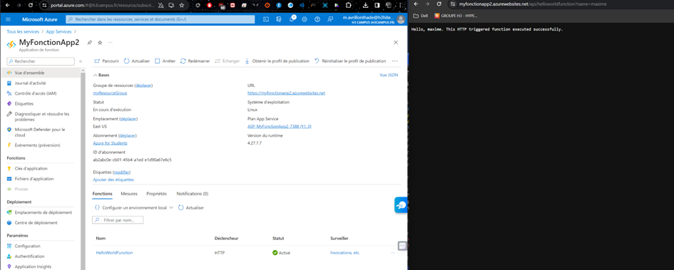

[Back to Home](../README.md)

# Implement a simple Azure Functions



## Export template

```
{
    "$schema": "https://schema.management.azure.com/schemas/2019-04-01/deploymentTemplate.json#",
    "contentVersion": "1.0.0.0",
    "parameters": {
        "sites_MyFonctionApp2_name": {
            "defaultValue": "MyFonctionApp2",
            "type": "String"
        },
        "serverfarms_ASP_MyFonctionApp2_7388_externalid": {
            "defaultValue": "/subscriptions/ab2abc0e-cb01-45b4-a1ed-e1d90a67e6c5/resourceGroups/myResourceGroup/providers/Microsoft.Web/serverfarms/ASP-MyFonctionApp2-7388",
            "type": "String"
        }
    },
    "variables": {},
    "resources": [
        {
            "type": "Microsoft.Web/sites",
            "apiVersion": "2023-01-01",
            "name": "[parameters('sites_MyFonctionApp2_name')]",
            "location": "East US",
            "kind": "functionapp,linux",
            "properties": {
                "enabled": true,
                "hostNameSslStates": [
                    {
                        "name": "myfonctionapp2.azurewebsites.net",
                        "sslState": "Disabled",
                        "hostType": "Standard"
                    },
                    {
                        "name": "myfonctionapp2.scm.azurewebsites.net",
                        "sslState": "Disabled",
                        "hostType": "Repository"
                    }
                ],
                "serverFarmId": "[parameters('serverfarms_ASP_MyFonctionApp2_7388_externalid')]",
                "reserved": true,
                "isXenon": false,
                "hyperV": false,
                "vnetRouteAllEnabled": false,
                "vnetImagePullEnabled": false,
                "vnetContentShareEnabled": false,
                "siteConfig": {
                    "numberOfWorkers": 1,
                    "linuxFxVersion": "Python|3.11",
                    "acrUseManagedIdentityCreds": false,
                    "alwaysOn": false,
                    "http20Enabled": false,
                    "functionAppScaleLimit": 200,
                    "minimumElasticInstanceCount": 0
                },
                "scmSiteAlsoStopped": false,
                "clientAffinityEnabled": false,
                "clientCertEnabled": false,
                "clientCertMode": "Required",
                "hostNamesDisabled": false,
                "customDomainVerificationId": "D4F60F782D279FBDA2B65C3A627A5D84A53799B4843CF1F5A8F17AD89B3CAE93",
                "containerSize": 0,
                "dailyMemoryTimeQuota": 0,
                "httpsOnly": false,
                "redundancyMode": "None",
                "storageAccountRequired": false,
                "keyVaultReferenceIdentity": "SystemAssigned"
            }
        },
        {
            "type": "Microsoft.Web/sites/basicPublishingCredentialsPolicies",
            "apiVersion": "2023-01-01",
            "name": "[concat(parameters('sites_MyFonctionApp2_name'), '/ftp')]",
            "location": "East US",
            "dependsOn": [
                "[resourceId('Microsoft.Web/sites', parameters('sites_MyFonctionApp2_name'))]"
            ],
            "properties": {
                "allow": true
            }
        },
        {
            "type": "Microsoft.Web/sites/basicPublishingCredentialsPolicies",
            "apiVersion": "2023-01-01",
            "name": "[concat(parameters('sites_MyFonctionApp2_name'), '/scm')]",
            "location": "East US",
            "dependsOn": [
                "[resourceId('Microsoft.Web/sites', parameters('sites_MyFonctionApp2_name'))]"
            ],
            "properties": {
                "allow": true
            }
        },
        {
            "type": "Microsoft.Web/sites/config",
            "apiVersion": "2023-01-01",
            "name": "[concat(parameters('sites_MyFonctionApp2_name'), '/web')]",
            "location": "East US",
            "dependsOn": [
                "[resourceId('Microsoft.Web/sites', parameters('sites_MyFonctionApp2_name'))]"
            ],
            "properties": {
                "numberOfWorkers": 1,
                "defaultDocuments": [
                    "Default.htm",
                    "Default.html",
                    "Default.asp",
                    "index.htm",
                    "index.html",
                    "iisstart.htm",
                    "default.aspx",
                    "index.php"
                ],
                "netFrameworkVersion": "v4.0",
                "linuxFxVersion": "Python|3.11",
                "requestTracingEnabled": false,
                "remoteDebuggingEnabled": false,
                "httpLoggingEnabled": false,
                "acrUseManagedIdentityCreds": false,
                "logsDirectorySizeLimit": 35,
                "detailedErrorLoggingEnabled": false,
                "publishingUsername": "$MyFonctionApp2",
                "scmType": "None",
                "use32BitWorkerProcess": false,
                "webSocketsEnabled": false,
                "alwaysOn": false,
                "managedPipelineMode": "Integrated",
                "virtualApplications": [
                    {
                        "virtualPath": "/",
                        "physicalPath": "site\\wwwroot",
                        "preloadEnabled": false
                    }
                ],
                "loadBalancing": "LeastRequests",
                "experiments": {
                    "rampUpRules": []
                },
                "autoHealEnabled": false,
                "vnetRouteAllEnabled": false,
                "vnetPrivatePortsCount": 0,
                "localMySqlEnabled": false,
                "ipSecurityRestrictions": [
                    {
                        "ipAddress": "Any",
                        "action": "Allow",
                        "priority": 2147483647,
                        "name": "Allow all",
                        "description": "Allow all access"
                    }
                ],
                "scmIpSecurityRestrictions": [
                    {
                        "ipAddress": "Any",
                        "action": "Allow",
                        "priority": 2147483647,
                        "name": "Allow all",
                        "description": "Allow all access"
                    }
                ],
                "scmIpSecurityRestrictionsUseMain": false,
                "http20Enabled": false,
                "minTlsVersion": "1.2",
                "scmMinTlsVersion": "1.2",
                "ftpsState": "FtpsOnly",
                "preWarmedInstanceCount": 0,
                "functionAppScaleLimit": 200,
                "functionsRuntimeScaleMonitoringEnabled": false,
                "minimumElasticInstanceCount": 0,
                "azureStorageAccounts": {}
            }
        },
        {
            "type": "Microsoft.Web/sites/functions",
            "apiVersion": "2023-01-01",
            "name": "[concat(parameters('sites_MyFonctionApp2_name'), '/HelloWorldFunction')]",
            "location": "East US",
            "dependsOn": [
                "[resourceId('Microsoft.Web/sites', parameters('sites_MyFonctionApp2_name'))]"
            ],
            "properties": {
                "script_href": "https://myfonctionapp2.azurewebsites.net/admin/vfs/home/site/wwwroot/function_app.py",
                "test_data_href": "https://myfonctionapp2.azurewebsites.net/admin/vfs/tmp/FunctionsData/HelloWorldFunction.dat",
                "href": "https://myfonctionapp2.azurewebsites.net/admin/functions/HelloWorldFunction",
                "config": {},
                "invoke_url_template": "https://myfonctionapp2.azurewebsites.net/api/helloworldfunction",
                "language": "python",
                "isDisabled": false
            }
        },
        {
            "type": "Microsoft.Web/sites/hostNameBindings",
            "apiVersion": "2023-01-01",
            "name": "[concat(parameters('sites_MyFonctionApp2_name'), '/', parameters('sites_MyFonctionApp2_name'), '.azurewebsites.net')]",
            "location": "East US",
            "dependsOn": [
                "[resourceId('Microsoft.Web/sites', parameters('sites_MyFonctionApp2_name'))]"
            ],
            "properties": {
                "siteName": "MyFonctionApp2",
                "hostNameType": "Verified"
            }
        }
    ]
}
```
