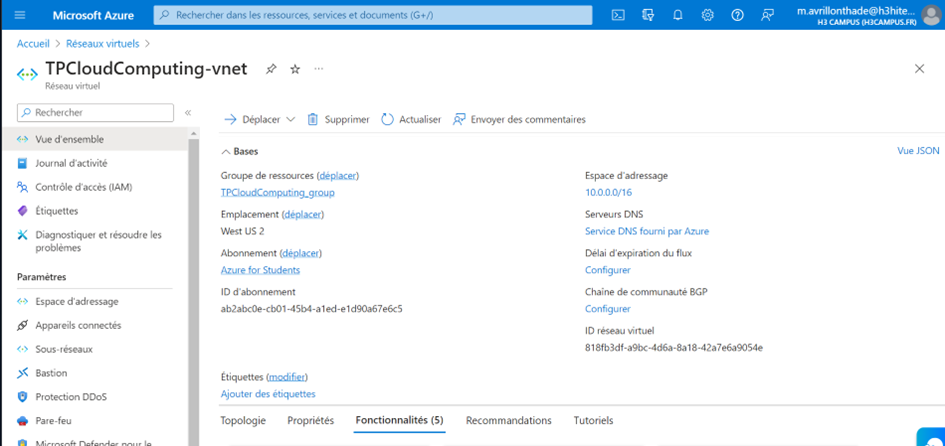

[Back to Home](../README.md)

# Set Up a Networking ressource

In this section, I established a Virtual Network in Azure



## Export template

```
{
    "$schema": "https://schema.management.azure.com/schemas/2019-04-01/deploymentTemplate.json#",
    "contentVersion": "1.0.0.0",
    "parameters": {
        "virtualNetworks_TPCloudComputing_vnet_name": {
            "defaultValue": "TPCloudComputing-vnet",
            "type": "String"
        }
    },
    "variables": {},
    "resources": [
        {
            "type": "Microsoft.Network/virtualNetworks",
            "apiVersion": "2023-06-01",
            "name": "[parameters('virtualNetworks_TPCloudComputing_vnet_name')]",
            "location": "westus2",
            "properties": {
                "addressSpace": {
                    "addressPrefixes": [
                        "10.0.0.0/16"
                    ]
                },
                "subnets": [
                    {
                        "name": "default",
                        "id": "[resourceId('Microsoft.Network/virtualNetworks/subnets', parameters('virtualNetworks_TPCloudComputing_vnet_name'), 'default')]",
                        "properties": {
                            "addressPrefix": "10.0.0.0/24",
                            "delegations": [],
                            "privateEndpointNetworkPolicies": "Disabled",
                            "privateLinkServiceNetworkPolicies": "Enabled"
                        },
                        "type": "Microsoft.Network/virtualNetworks/subnets"
                    },
                    {
                        "name": "AzureBastionSubnet",
                        "id": "[resourceId('Microsoft.Network/virtualNetworks/subnets', parameters('virtualNetworks_TPCloudComputing_vnet_name'), 'AzureBastionSubnet')]",
                        "properties": {
                            "addressPrefix": "10.0.1.0/26",
                            "delegations": [],
                            "privateEndpointNetworkPolicies": "Disabled",
                            "privateLinkServiceNetworkPolicies": "Enabled"
                        },
                        "type": "Microsoft.Network/virtualNetworks/subnets"
                    }
                ],
                "virtualNetworkPeerings": [],
                "enableDdosProtection": false
            }
        },
        {
            "type": "Microsoft.Network/virtualNetworks/subnets",
            "apiVersion": "2023-06-01",
            "name": "[concat(parameters('virtualNetworks_TPCloudComputing_vnet_name'), '/AzureBastionSubnet')]",
            "dependsOn": [
                "[resourceId('Microsoft.Network/virtualNetworks', parameters('virtualNetworks_TPCloudComputing_vnet_name'))]"
            ],
            "properties": {
                "addressPrefix": "10.0.1.0/26",
                "delegations": [],
                "privateEndpointNetworkPolicies": "Disabled",
                "privateLinkServiceNetworkPolicies": "Enabled"
            }
        },
        {
            "type": "Microsoft.Network/virtualNetworks/subnets",
            "apiVersion": "2023-06-01",
            "name": "[concat(parameters('virtualNetworks_TPCloudComputing_vnet_name'), '/default')]",
            "dependsOn": [
                "[resourceId('Microsoft.Network/virtualNetworks', parameters('virtualNetworks_TPCloudComputing_vnet_name'))]"
            ],
            "properties": {
                "addressPrefix": "10.0.0.0/24",
                "delegations": [],
                "privateEndpointNetworkPolicies": "Disabled",
                "privateLinkServiceNetworkPolicies": "Enabled"
            }
        }
    ]
}
```
