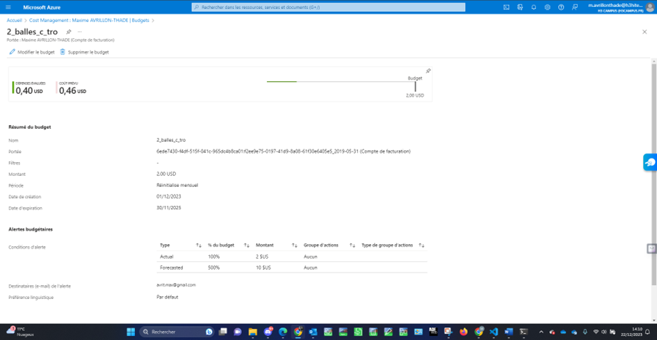

[Back to Home](../README.md)

# Configure Monitoring and Logging

In this section, I established a Virtual Network in Azure, providing an isolated and secure environment for resource communication and traffic management.
We can see a cost alarm if it exceeds $2.

