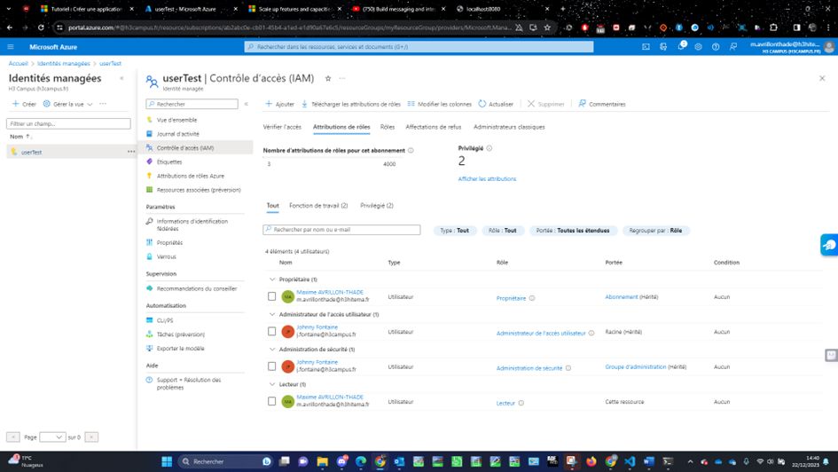

[Back to Home](../README.md)

# Implement Azure Identity by Creating A Simple Reader Role

This part shows how I implemented Azure Identity by creating a simple Reader role



## Export template

```
{
    "$schema": "https://schema.management.azure.com/schemas/2019-04-01/deploymentTemplate.json#",
    "contentVersion": "1.0.0.0",
    "parameters": {
        "userAssignedIdentities_userTest_name": {
            "defaultValue": "userTest",
            "type": "String"
        }
    },
    "variables": {},
    "resources": [
        {
            "type": "Microsoft.ManagedIdentity/userAssignedIdentities",
            "apiVersion": "2023-01-31",
            "name": "[parameters('userAssignedIdentities_userTest_name')]",
            "location": "westus2"
        }
    ]
}
```
