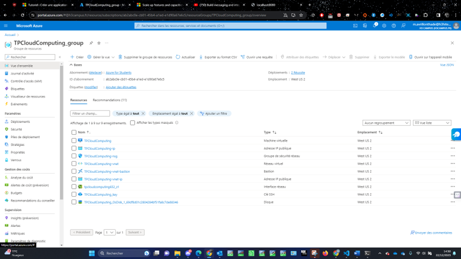
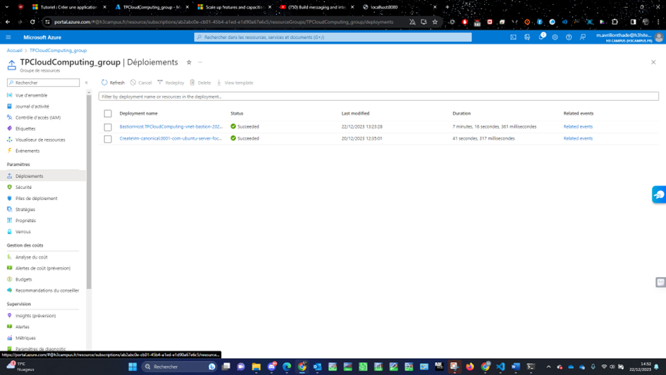

[Back to Home](../README.md)

# Create a personalized Resource Group




## Export template

```
{
    "$schema": "https://schema.management.azure.com/schemas/2019-04-01/deploymentTemplate.json#",
    "contentVersion": "1.0.0.0",
    "parameters": {
        "virtualMachines_TPCloudComputing_name": {
            "defaultValue": "TPCloudComputing",
            "type": "String"
        },
        "sshPublicKeys_TPCloudComputing_key_name": {
            "defaultValue": "TPCloudComputing_key",
            "type": "String"
        },
        "publicIPAddresses_TPCloudComputing_ip_name": {
            "defaultValue": "TPCloudComputing-ip",
            "type": "String"
        },
        "virtualNetworks_TPCloudComputing_vnet_name": {
            "defaultValue": "TPCloudComputing-vnet",
            "type": "String"
        },
        "networkInterfaces_tpcloudcomputing652_z1_name": {
            "defaultValue": "tpcloudcomputing652_z1",
            "type": "String"
        },
        "bastionHosts_TPCloudComputing_vnet_bastion_name": {
            "defaultValue": "TPCloudComputing-vnet-bastion",
            "type": "String"
        },
        "networkSecurityGroups_TPCloudComputing_nsg_name": {
            "defaultValue": "TPCloudComputing-nsg",
            "type": "String"
        },
        "publicIPAddresses_TPCloudComputing_vnet_ip_name": {
            "defaultValue": "TPCloudComputing-vnet-ip",
            "type": "String"
        },
        "schedules_shutdown_computevm_tpcloudcomputing_name": {
            "defaultValue": "shutdown-computevm-tpcloudcomputing",
            "type": "String"
        }
    },
    "variables": {},
    "resources": [
        {
            "type": "Microsoft.Compute/sshPublicKeys",
            "apiVersion": "2023-03-01",
            "name": "[parameters('sshPublicKeys_TPCloudComputing_key_name')]",
            "location": "westus2",
            "properties": {
                "publicKey": "ssh-rsa AAAAB3NzaC1yc2EAAAADAQABAAABgQC1hhYPHpzrSieWy4DbT5gA6fKpf3zhEyu+zAsIv3QN9QWLyna2yCt0gypf8Snoz3h1Hzuqh6lo0CAU+dAAccqtX0aIfS8AzUHPLAO3T6uInhL5wm/J0XcLr30jm2Ncf/v+n9aYXaBbx3A35rDGOF0kNPiCeZtRC4I+zBxx6RmHyX5oX79CTfzI2SRjwuAuxIcMiRUCyhJ+q81GB0P3VlSBrXu1elLVH7+M6L9CpFCrHL+n6i6Gy1Kc/oSsygk3SSJOCAu/56nTyFni8L4UWAiCdqM7FJUBMUkENSPg0M5mr+HhtS+dfpc0w7DwtMed7MNzUfHd/D3LegBxDbFt5MfuDeVkY11PEDr6hdrB1mrLTdTsJmTGJM7nib9HRXeQtqY6AANG7+o69s4VIDiH1hz4kwYOy1arL9tVxTehm0XAC3ReM2e3zzzVpU5oe2gJpMdQ2NQohrb31oQXgaIqGTZ6xu7CcMZnyXSo6BBQX+4vpgkUx1sMCzf0ztjLkFwJuuk= generated-by-azure"
            }
        },
        {
            "type": "Microsoft.Network/networkSecurityGroups",
            "apiVersion": "2023-06-01",
            "name": "[parameters('networkSecurityGroups_TPCloudComputing_nsg_name')]",
            "location": "westus2",
            "properties": {
                "securityRules": [
                    {
                        "name": "SSH",
                        "id": "[resourceId('Microsoft.Network/networkSecurityGroups/securityRules', parameters('networkSecurityGroups_TPCloudComputing_nsg_name'), 'SSH')]",
                        "type": "Microsoft.Network/networkSecurityGroups/securityRules",
                        "properties": {
                            "protocol": "TCP",
                            "sourcePortRange": "*",
                            "destinationPortRange": "22",
                            "sourceAddressPrefix": "*",
                            "destinationAddressPrefix": "*",
                            "access": "Allow",
                            "priority": 300,
                            "direction": "Inbound",
                            "sourcePortRanges": [],
                            "destinationPortRanges": [],
                            "sourceAddressPrefixes": [],
                            "destinationAddressPrefixes": []
                        }
                    },
                    {
                        "name": "HTTP",
                        "id": "[resourceId('Microsoft.Network/networkSecurityGroups/securityRules', parameters('networkSecurityGroups_TPCloudComputing_nsg_name'), 'HTTP')]",
                        "type": "Microsoft.Network/networkSecurityGroups/securityRules",
                        "properties": {
                            "protocol": "TCP",
                            "sourcePortRange": "*",
                            "destinationPortRange": "80",
                            "sourceAddressPrefix": "*",
                            "destinationAddressPrefix": "*",
                            "access": "Allow",
                            "priority": 320,
                            "direction": "Inbound",
                            "sourcePortRanges": [],
                            "destinationPortRanges": [],
                            "sourceAddressPrefixes": [],
                            "destinationAddressPrefixes": []
                        }
                    },
                    {
                        "name": "HTTPS",
                        "id": "[resourceId('Microsoft.Network/networkSecurityGroups/securityRules', parameters('networkSecurityGroups_TPCloudComputing_nsg_name'), 'HTTPS')]",
                        "type": "Microsoft.Network/networkSecurityGroups/securityRules",
                        "properties": {
                            "protocol": "TCP",
                            "sourcePortRange": "*",
                            "destinationPortRange": "443",
                            "sourceAddressPrefix": "*",
                            "destinationAddressPrefix": "*",
                            "access": "Allow",
                            "priority": 340,
                            "direction": "Inbound",
                            "sourcePortRanges": [],
                            "destinationPortRanges": [],
                            "sourceAddressPrefixes": [],
                            "destinationAddressPrefixes": []
                        }
                    }
                ]
            }
        },
        {
            "type": "Microsoft.Network/publicIPAddresses",
            "apiVersion": "2023-06-01",
            "name": "[parameters('publicIPAddresses_TPCloudComputing_ip_name')]",
            "location": "westus2",
            "sku": {
                "name": "Standard",
                "tier": "Regional"
            },
            "zones": [
                "1"
            ],
            "properties": {
                "ipAddress": "20.9.140.188",
                "publicIPAddressVersion": "IPv4",
                "publicIPAllocationMethod": "Static",
                "idleTimeoutInMinutes": 4,
                "dnsSettings": {
                    "domainNameLabel": "tpcloudcomputing",
                    "fqdn": "tpcloudcomputing.westus2.cloudapp.azure.com"
                },
                "ipTags": [],
                "ddosSettings": {
                    "protectionMode": "VirtualNetworkInherited"
                }
            }
        },
        {
            "type": "Microsoft.Network/publicIPAddresses",
            "apiVersion": "2023-06-01",
            "name": "[parameters('publicIPAddresses_TPCloudComputing_vnet_ip_name')]",
            "location": "westus2",
            "sku": {
                "name": "Standard",
                "tier": "Regional"
            },
            "properties": {
                "ipAddress": "4.155.59.216",
                "publicIPAddressVersion": "IPv4",
                "publicIPAllocationMethod": "Static",
                "idleTimeoutInMinutes": 4,
                "ipTags": []
            }
        },
        {
            "type": "Microsoft.Network/virtualNetworks",
            "apiVersion": "2023-06-01",
            "name": "[parameters('virtualNetworks_TPCloudComputing_vnet_name')]",
            "location": "westus2",
            "properties": {
                "addressSpace": {
                    "addressPrefixes": [
                        "10.0.0.0/16"
                    ]
                },
                "subnets": [
                    {
                        "name": "default",
                        "id": "[resourceId('Microsoft.Network/virtualNetworks/subnets', parameters('virtualNetworks_TPCloudComputing_vnet_name'), 'default')]",
                        "properties": {
                            "addressPrefix": "10.0.0.0/24",
                            "delegations": [],
                            "privateEndpointNetworkPolicies": "Disabled",
                            "privateLinkServiceNetworkPolicies": "Enabled"
                        },
                        "type": "Microsoft.Network/virtualNetworks/subnets"
                    },
                    {
                        "name": "AzureBastionSubnet",
                        "id": "[resourceId('Microsoft.Network/virtualNetworks/subnets', parameters('virtualNetworks_TPCloudComputing_vnet_name'), 'AzureBastionSubnet')]",
                        "properties": {
                            "addressPrefix": "10.0.1.0/26",
                            "delegations": [],
                            "privateEndpointNetworkPolicies": "Disabled",
                            "privateLinkServiceNetworkPolicies": "Enabled"
                        },
                        "type": "Microsoft.Network/virtualNetworks/subnets"
                    }
                ],
                "virtualNetworkPeerings": [],
                "enableDdosProtection": false
            }
        },
        {
            "type": "Microsoft.Compute/virtualMachines",
            "apiVersion": "2023-03-01",
            "name": "[parameters('virtualMachines_TPCloudComputing_name')]",
            "location": "westus2",
            "dependsOn": [
                "[resourceId('Microsoft.Network/networkInterfaces', parameters('networkInterfaces_tpcloudcomputing652_z1_name'))]"
            ],
            "zones": [
                "1"
            ],
            "identity": {
                "type": "SystemAssigned"
            },
            "properties": {
                "hardwareProfile": {
                    "vmSize": "Standard_B2as_v2"
                },
                "additionalCapabilities": {
                    "hibernationEnabled": false
                },
                "storageProfile": {
                    "imageReference": {
                        "publisher": "canonical",
                        "offer": "0001-com-ubuntu-server-focal",
                        "sku": "20_04-lts-gen2",
                        "version": "latest"
                    },
                    "osDisk": {
                        "osType": "Linux",
                        "name": "[concat(parameters('virtualMachines_TPCloudComputing_name'), '_OsDisk_1_69df8d01c2804284bf51fa8c7de88346')]",
                        "createOption": "FromImage",
                        "caching": "ReadWrite",
                        "managedDisk": {
                            "id": "[resourceId('Microsoft.Compute/disks', concat(parameters('virtualMachines_TPCloudComputing_name'), '_OsDisk_1_69df8d01c2804284bf51fa8c7de88346'))]"
                        },
                        "deleteOption": "Delete"
                    },
                    "dataDisks": [],
                    "diskControllerType": "SCSI"
                },
                "osProfile": {
                    "computerName": "[parameters('virtualMachines_TPCloudComputing_name')]",
                    "adminUsername": "ERTKid",
                    "linuxConfiguration": {
                        "disablePasswordAuthentication": true,
                        "ssh": {
                            "publicKeys": [
                                {
                                    "path": "/home/ERTKid/.ssh/authorized_keys",
                                    "keyData": "ssh-rsa AAAAB3NzaC1yc2EAAAADAQABAAABgQC1hhYPHpzrSieWy4DbT5gA6fKpf3zhEyu+zAsIv3QN9QWLyna2yCt0gypf8Snoz3h1Hzuqh6lo0CAU+dAAccqtX0aIfS8AzUHPLAO3T6uInhL5wm/J0XcLr30jm2Ncf/v+n9aYXaBbx3A35rDGOF0kNPiCeZtRC4I+zBxx6RmHyX5oX79CTfzI2SRjwuAuxIcMiRUCyhJ+q81GB0P3VlSBrXu1elLVH7+M6L9CpFCrHL+n6i6Gy1Kc/oSsygk3SSJOCAu/56nTyFni8L4UWAiCdqM7FJUBMUkENSPg0M5mr+HhtS+dfpc0w7DwtMed7MNzUfHd/D3LegBxDbFt5MfuDeVkY11PEDr6hdrB1mrLTdTsJmTGJM7nib9HRXeQtqY6AANG7+o69s4VIDiH1hz4kwYOy1arL9tVxTehm0XAC3ReM2e3zzzVpU5oe2gJpMdQ2NQohrb31oQXgaIqGTZ6xu7CcMZnyXSo6BBQX+4vpgkUx1sMCzf0ztjLkFwJuuk= generated-by-azure"
                                }
                            ]
                        },
                        "provisionVMAgent": true,
                        "patchSettings": {
                            "patchMode": "ImageDefault",
                            "assessmentMode": "ImageDefault"
                        },
                        "enableVMAgentPlatformUpdates": false
                    },
                    "secrets": [],
                    "allowExtensionOperations": true,
                    "requireGuestProvisionSignal": true
                },
                "networkProfile": {
                    "networkInterfaces": [
                        {
                            "id": "[resourceId('Microsoft.Network/networkInterfaces', parameters('networkInterfaces_tpcloudcomputing652_z1_name'))]",
                            "properties": {
                                "deleteOption": "Detach"
                            }
                        }
                    ]
                },
                "diagnosticsProfile": {
                    "bootDiagnostics": {
                        "enabled": true
                    }
                },
                "priority": "Spot",
                "evictionPolicy": "Deallocate",
                "billingProfile": {
                    "maxPrice": -1
                }
            }
        },
        {
            "type": "microsoft.devtestlab/schedules",
            "apiVersion": "2018-09-15",
            "name": "[parameters('schedules_shutdown_computevm_tpcloudcomputing_name')]",
            "location": "westus2",
            "dependsOn": [
                "[resourceId('Microsoft.Compute/virtualMachines', parameters('virtualMachines_TPCloudComputing_name'))]"
            ],
            "properties": {
                "status": "Enabled",
                "taskType": "ComputeVmShutdownTask",
                "dailyRecurrence": {
                    "time": "1720"
                },
                "timeZoneId": "Romance Standard Time",
                "notificationSettings": {
                    "status": "Enabled",
                    "timeInMinutes": 30,
                    "emailRecipient": "m.avrillonthade@h3hitema.fr",
                    "notificationLocale": "fr"
                },
                "targetResourceId": "[resourceId('Microsoft.Compute/virtualMachines', parameters('virtualMachines_TPCloudComputing_name'))]"
            }
        },
        {
            "type": "Microsoft.Network/networkSecurityGroups/securityRules",
            "apiVersion": "2023-06-01",
            "name": "[concat(parameters('networkSecurityGroups_TPCloudComputing_nsg_name'), '/HTTP')]",
            "dependsOn": [
                "[resourceId('Microsoft.Network/networkSecurityGroups', parameters('networkSecurityGroups_TPCloudComputing_nsg_name'))]"
            ],
            "properties": {
                "protocol": "TCP",
                "sourcePortRange": "*",
                "destinationPortRange": "80",
                "sourceAddressPrefix": "*",
                "destinationAddressPrefix": "*",
                "access": "Allow",
                "priority": 320,
                "direction": "Inbound",
                "sourcePortRanges": [],
                "destinationPortRanges": [],
                "sourceAddressPrefixes": [],
                "destinationAddressPrefixes": []
            }
        },
        {
            "type": "Microsoft.Network/networkSecurityGroups/securityRules",
            "apiVersion": "2023-06-01",
            "name": "[concat(parameters('networkSecurityGroups_TPCloudComputing_nsg_name'), '/HTTPS')]",
            "dependsOn": [
                "[resourceId('Microsoft.Network/networkSecurityGroups', parameters('networkSecurityGroups_TPCloudComputing_nsg_name'))]"
            ],
            "properties": {
                "protocol": "TCP",
                "sourcePortRange": "*",
                "destinationPortRange": "443",
                "sourceAddressPrefix": "*",
                "destinationAddressPrefix": "*",
                "access": "Allow",
                "priority": 340,
                "direction": "Inbound",
                "sourcePortRanges": [],
                "destinationPortRanges": [],
                "sourceAddressPrefixes": [],
                "destinationAddressPrefixes": []
            }
        },
        {
            "type": "Microsoft.Network/networkSecurityGroups/securityRules",
            "apiVersion": "2023-06-01",
            "name": "[concat(parameters('networkSecurityGroups_TPCloudComputing_nsg_name'), '/SSH')]",
            "dependsOn": [
                "[resourceId('Microsoft.Network/networkSecurityGroups', parameters('networkSecurityGroups_TPCloudComputing_nsg_name'))]"
            ],
            "properties": {
                "protocol": "TCP",
                "sourcePortRange": "*",
                "destinationPortRange": "22",
                "sourceAddressPrefix": "*",
                "destinationAddressPrefix": "*",
                "access": "Allow",
                "priority": 300,
                "direction": "Inbound",
                "sourcePortRanges": [],
                "destinationPortRanges": [],
                "sourceAddressPrefixes": [],
                "destinationAddressPrefixes": []
            }
        },
        {
            "type": "Microsoft.Network/virtualNetworks/subnets",
            "apiVersion": "2023-06-01",
            "name": "[concat(parameters('virtualNetworks_TPCloudComputing_vnet_name'), '/AzureBastionSubnet')]",
            "dependsOn": [
                "[resourceId('Microsoft.Network/virtualNetworks', parameters('virtualNetworks_TPCloudComputing_vnet_name'))]"
            ],
            "properties": {
                "addressPrefix": "10.0.1.0/26",
                "delegations": [],
                "privateEndpointNetworkPolicies": "Disabled",
                "privateLinkServiceNetworkPolicies": "Enabled"
            }
        },
        {
            "type": "Microsoft.Network/virtualNetworks/subnets",
            "apiVersion": "2023-06-01",
            "name": "[concat(parameters('virtualNetworks_TPCloudComputing_vnet_name'), '/default')]",
            "dependsOn": [
                "[resourceId('Microsoft.Network/virtualNetworks', parameters('virtualNetworks_TPCloudComputing_vnet_name'))]"
            ],
            "properties": {
                "addressPrefix": "10.0.0.0/24",
                "delegations": [],
                "privateEndpointNetworkPolicies": "Disabled",
                "privateLinkServiceNetworkPolicies": "Enabled"
            }
        },
        {
            "type": "Microsoft.Network/bastionHosts",
            "apiVersion": "2023-06-01",
            "name": "[parameters('bastionHosts_TPCloudComputing_vnet_bastion_name')]",
            "location": "westus2",
            "dependsOn": [
                "[resourceId('Microsoft.Network/publicIPAddresses', parameters('publicIPAddresses_TPCloudComputing_vnet_ip_name'))]",
                "[resourceId('Microsoft.Network/virtualNetworks/subnets', parameters('virtualNetworks_TPCloudComputing_vnet_name'), 'AzureBastionSubnet')]"
            ],
            "sku": {
                "name": "Basic"
            },
            "properties": {
                "dnsName": "bst-c063d8dc-49ed-499a-9899-7a73acc008e5.bastion.azure.com",
                "scaleUnits": 2,
                "enableTunneling": false,
                "enableIpConnect": false,
                "disableCopyPaste": false,
                "enableShareableLink": false,
                "enableKerberos": false,
                "ipConfigurations": [
                    {
                        "name": "IpConf",
                        "id": "[concat(resourceId('Microsoft.Network/bastionHosts', parameters('bastionHosts_TPCloudComputing_vnet_bastion_name')), '/bastionHostIpConfigurations/IpConf')]",
                        "properties": {
                            "privateIPAllocationMethod": "Dynamic",
                            "publicIPAddress": {
                                "id": "[resourceId('Microsoft.Network/publicIPAddresses', parameters('publicIPAddresses_TPCloudComputing_vnet_ip_name'))]"
                            },
                            "subnet": {
                                "id": "[resourceId('Microsoft.Network/virtualNetworks/subnets', parameters('virtualNetworks_TPCloudComputing_vnet_name'), 'AzureBastionSubnet')]"
                            }
                        }
                    }
                ]
            }
        },
        {
            "type": "Microsoft.Network/networkInterfaces",
            "apiVersion": "2023-06-01",
            "name": "[parameters('networkInterfaces_tpcloudcomputing652_z1_name')]",
            "location": "westus2",
            "dependsOn": [
                "[resourceId('Microsoft.Network/publicIPAddresses', parameters('publicIPAddresses_TPCloudComputing_ip_name'))]",
                "[resourceId('Microsoft.Network/virtualNetworks/subnets', parameters('virtualNetworks_TPCloudComputing_vnet_name'), 'default')]",
                "[resourceId('Microsoft.Network/networkSecurityGroups', parameters('networkSecurityGroups_TPCloudComputing_nsg_name'))]"
            ],
            "kind": "Regular",
            "properties": {
                "ipConfigurations": [
                    {
                        "name": "ipconfig1",
                        "id": "[concat(resourceId('Microsoft.Network/networkInterfaces', parameters('networkInterfaces_tpcloudcomputing652_z1_name')), '/ipConfigurations/ipconfig1')]",
                        "etag": "W/\"5405ba77-fd00-4beb-959a-54de4e8f6530\"",
                        "type": "Microsoft.Network/networkInterfaces/ipConfigurations",
                        "properties": {
                            "provisioningState": "Succeeded",
                            "privateIPAddress": "10.0.0.4",
                            "privateIPAllocationMethod": "Dynamic",
                            "publicIPAddress": {
                                "id": "[resourceId('Microsoft.Network/publicIPAddresses', parameters('publicIPAddresses_TPCloudComputing_ip_name'))]",
                                "properties": {
                                    "deleteOption": "Detach"
                                }
                            },
                            "subnet": {
                                "id": "[resourceId('Microsoft.Network/virtualNetworks/subnets', parameters('virtualNetworks_TPCloudComputing_vnet_name'), 'default')]"
                            },
                            "primary": true,
                            "privateIPAddressVersion": "IPv4"
                        }
                    }
                ],
                "dnsSettings": {
                    "dnsServers": []
                },
                "enableAcceleratedNetworking": false,
                "enableIPForwarding": false,
                "disableTcpStateTracking": false,
                "networkSecurityGroup": {
                    "id": "[resourceId('Microsoft.Network/networkSecurityGroups', parameters('networkSecurityGroups_TPCloudComputing_nsg_name'))]"
                },
                "nicType": "Standard",
                "auxiliaryMode": "None",
                "auxiliarySku": "None"
            }
        }
    ]
}
```
